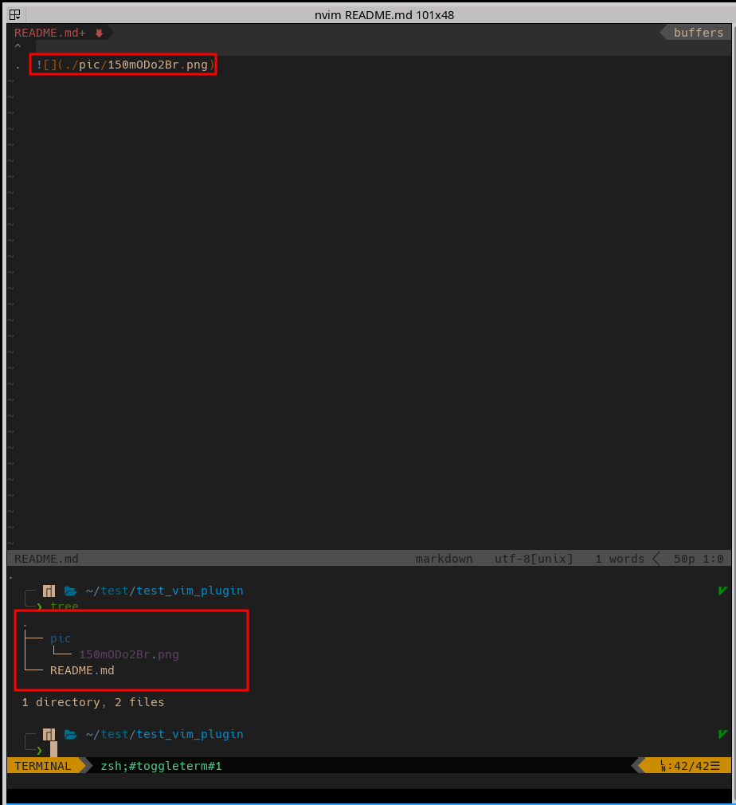
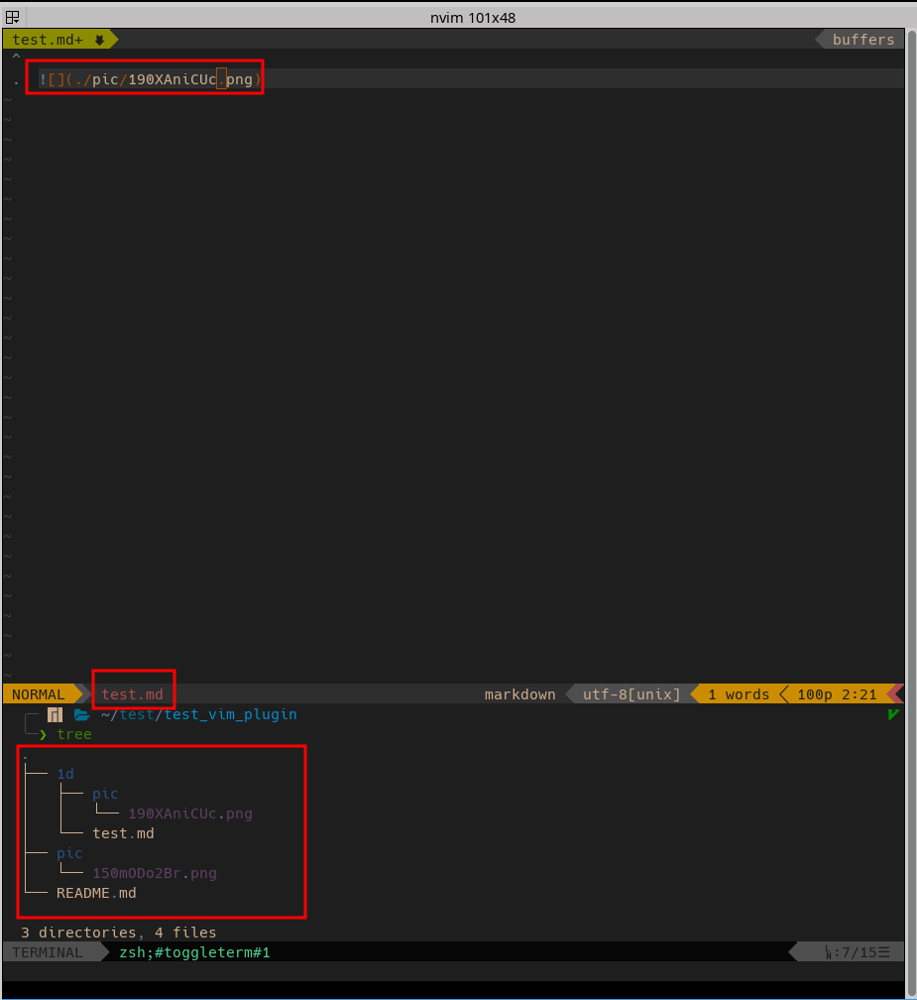
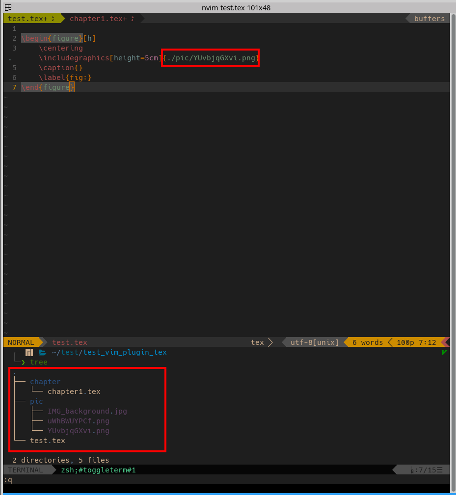
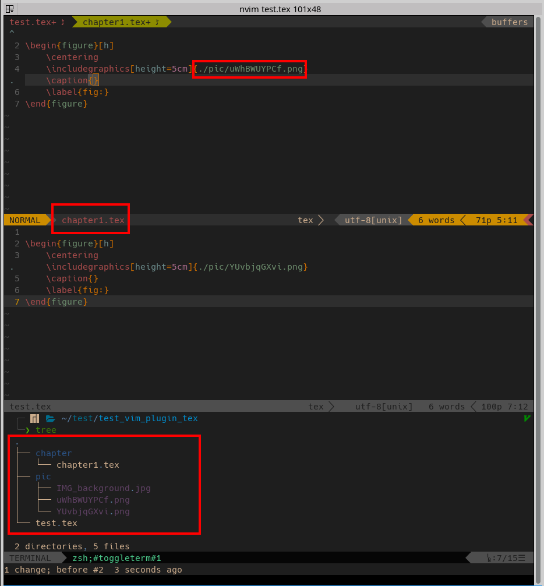

# picture_name_paste.nvim

這是我第一次寫vim的套件，所以有寫不好的地方還請各位多多指教。

---


參考許多線上編輯器可以將剪貼簿的點陣圖的圖自動上傳，並自動輸出文字的功能。基於這個想法，想說可以撰寫類似的套件，可以用來編輯本地的文件(目前這支援`markdown`與`tex`)。

這個套件主要的功能是將剪貼簿的點陣圖、圖的位置或預設路徑圖檔的名稱(不包括副檔名)，將其自動存於`pic`的目錄下(如果沒有`pic`目錄會自動創建)，並自動輸出文字於當前編輯的文檔。


## Installation

- 利用 [vim-plug](https://github.com/junegunn/vim-plug)

```
Plug 'chi-chun-1999/picture_name_paste.nvim'
```

## Configuration

必需在`.vimrc`的目錄下新增`lua require('picture_name_paste')`，才能使用本套件。


## Requirement

- xclip
- inkscape (當要移動`.svg`的圖檔，並轉為`.eps`檔時需要用到)

## 圖檔儲存注意事項

考量到`markdown`與`tex`的不同的特性，在`markdown`文檔中，會將圖檔存於與當前文檔同一目錄的`pic`目下；而`tex`文檔中，則是將圖檔存於與編輯器開啟的位置的`pic`目下，所以在編輯`tex`的文檔時，編輯器開啟的位置必需與要編譯的文檔在同一個目錄下。

### markdown 

如下圖，當編輯`./READMD.md`時，會將圖檔存於`./pic`中。

{:height="50%" width="50%"}

從下圖可以發現，如果是編輯`./1d/READMD.md`時，則會將圖檔存於`1d/pic`中。




### latex

在下圖中開啟編輯器的位置為`~/test/test_vim_plugin_tex/`，並且與要編譯的文件`~/test/test_vim_plugin_tex/test.tex`在同一目錄。



下圖中這裡新增`./chapter/chapter1.tex`的章節在`./chapter1`的目錄下，考慮latex在編輯時，是根據編輯文件的相對路徑尋找對應的圖檔，所以在`./chapter/chapter1.tex`的文檔中，貼上的文字為`./pic/g365.eps`




## 相關功能

### `PictureNamePasteTextClipboard`與`PictureNamePasteOnlyClipboard`

這兩個功能主要剪貼簿上的點陣圖(像是影幕擷圖)，是將其以10個亂數的檔名儲存對應的目錄下，並將檔名的文字貼到編輯的文檔中。

- `PictureNamePasteTextClipboard`：會根據不同的`filetype`插入圖片的程式碼，與圖片檔名一同貼上在編輯的文檔中
- `PictureNamePasteOnlyClipboard`：只貼上圖片檔名到游標下。


### `PictureNamePasteTextPicName`與`PictureNamePasteOnlyPicName`

這功能如以下影片，主要根據複製圖檔的檔名(不包括副檔名)，從路徑`g:PictureNamePaste_pic_ori_path`(可自行更改，這裡預設為`/home/user/Pictures/`)，依據`g:PictureNamePaste_search_priority`(這裡預設為['svg', 'png', 'jpg', 'jpeg'])的順序，選擇將對應的圖檔移到目標資料夾，並將檔名的文字貼到編輯的文檔中，

- `PictureNamePasteTextPicName`：會根據不同的`filetype`插入圖片的程式碼，與圖片檔名一同貼上在編輯的文檔中
- `PictureNamePasteOnlyPicName`：只貼上圖片檔名到游標下。


